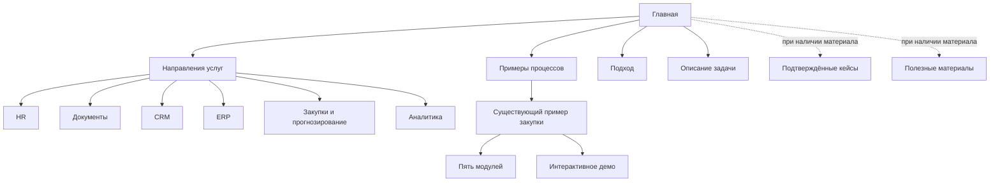

# Optimix — дизайн-документ полного редизайна главной

Дата: 6 октября 2026. Версия: 2.0. Статус: макет утверждён владельцем; начата реализация главной.

## 1. Бриф и границы

**Optimix автоматизирует и улучшает бизнес-процессы. Редизайн сохраняет эту тему и показывает полный спектр услуг.** Из референсов берём оформление, композицию и подачу. Их специализация на ценообразовании не переносится в предложение Optimix.

Подтверждено владельцем в этом чате: HR, документы, CRM, ERP, расчёт потребности в товарах, прогнозирование, аналитика и другие процессы, которые можно улучшить и автоматизировать. Это спектр услуг, а не подтверждение конкретных внедрений.

Текущий этап — аудит и дизайн-документ. Следующий этап реализации ограничивается главной. Архитектура всего сайта описана как ориентир развития, без автоматического разрешения создавать все внутренние страницы.

Приоритет источников: актуальный запрос владельца → четыре предоставленных сайта → текущий рендер и исходники Optimix → исторические документы. Старые варианты Operational Cinema и график закупочного процесса не определяют новый дизайн.

Связанные документы: [аудит референсов](./REFERENCE_AUDIT.md), [контент и архитектура](./CONTENT_AND_ARCHITECTURE.md), [индекс материалов](./README.md).

## 2. Цель и сценарии

Главная должна быстро объяснять: что делает Optimix, какие задачи охватывает, как меняется работа и с чего начать. Улучшение конверсии — гипотеза, для которой пока нет аналитических данных.

| Рабочая аудитория — гипотеза | Что ищет | Нужный участок | Действие |
|---|---|---|---|
| Владелец / руководитель | Где убрать ручную работу и освободить ресурсы | Hero, услуги, ожидаемые виды эффекта | Описать задачу |
| Руководитель HR / продаж / операций | Подходит ли подход его подразделению | Направления и функциональные примеры | Найти свой сценарий |
| ИТ-руководитель | Как решение связано с существующими системами | Интеграции, контроль, подход | Подготовить сведения о системах |
| Посетитель с готовой задачей | Быстрый путь к действию | Постоянный CTA | Открыть бриф |

Основной путь: предложение → своё направление → конкретный пример → подход → описание задачи. Альтернативный: первый экран → существующее демонстрационное демо закупки.

## 3. Рекомендуемое визуальное направление

**Светлая композиция Enable: крупный центрированный заголовок, одна зелёная акцентная строка, свободное пространство, простой CTA.** Ниже — большой пример процесса по логике IMA360 и функциональные сцены по логике Conga. Vendavo помогает структурировать широкий каталог задач и акцентный раздел результата.

Это одна система: не собирать четыре независимых палитры на одной странице.

| Приём | Источник | Применение |
|---|---|---|
| Типографический первый экран | [Enable](https://www.enable.com/) | Короткий H1, центр, зелёное выделение результата |
| Наглядное объяснение работы | [IMA360](https://ima360.com/) | Большая сцена процесса с объясняющими выносками |
| Функциональные блоки | [Conga POM](https://conga.com/platform/price-optimization-management) | Три группы услуг, каждая с собственным изображением |
| Широкий каталог задач | [Vendavo](https://www.vendavo.com/) | Шесть направлений и возможность описать другой процесс |
| Объяснение следующего шага | [IMA360: Demo](https://ima360.com/request-a-demo/) | Понятно, что посетитель подготовит и что получит |

Сходство создают композиция, масштаб, ритм, простые действия и показ работы. Чужие логотипы, интерфейсы, отзывы и цифры остаются материалами исследования.

## 4. Что меняется на главной

Текущая страница подробно разбирает пять переходов одной закупочной заявки. Новый дизайн:

- Сначала показывает автоматизацию бизнес-процессов и полный спектр услуг.
- Переносит закупочный маршрут в один из примеров.
- Заменяет абстрактный растущий график на понятную сцену работы.
- Сокращает пять длинных строк модулей до компактного маршрута со ссылками на существующие детали.
- Переходит к светлой основе, зелёному акценту и нескольким крупным предметным изображениям.
- Даёт отдельные композиции каталогу, примерам, подходу и финальному действию.

## 5. Последовательность секций

Высоты — ориентиры макета при 1440 px, не фиксированные ограничения для текста и локализации.

| № | Раздел | Задача | Композиция | Ориентир | Действие |
|---|---|---|---|---|---|
| 01 | Шапка | Навигация и быстрый путь | Лого слева, 4 пункта, языки, CTA | 80–88 px | Описать задачу |
| 02 | Hero | Широкое предложение | Центрированный H1, абзац, 2 действия | 540–660 px | Бриф / пример |
| 03 | Визуальный пример | Показать предмет автоматизации | Большая рамка с выносками и подписью | 400–520 px | Демо закупки |
| 04 | Направления | Найти свою задачу | 3 × 2 блока, строка «другой процесс» | 560–700 px | К связанной сцене |
| 05 | Функциональные сцены | Объяснить механику услуг | 3 сцены «изображение + текст» | 3 × 380–460 px | Пример / бриф |
| 06 | Управляемый процесс | Показать общий принцип | Тёмно-зелёная секция, краткий маршрут | 460–580 px | Существующее демо |
| 07 | Критерии результата | Основание для разговора об эффекте | Одна широкая панель, 3 критерия | 320–420 px | Описать процесс |
| 08 | Как начать | Снизить неопределённость | 4 шага, входные сведения | 360–440 px | Подготовить бриф |
| 09 | Системы и данные | Контекст существующей компании | Категории систем и условия | 300–380 px | Указать свои системы |
| 10 | FAQ | Ответить на возражения | Заголовок + 5 вопросов | 400–520 px | Уточнить задачу |
| 11 | Финальный CTA | Завершить путь | Широкая зелёная панель | 260–320 px | Описать задачу |
| 12 | Подвал | Навигация и сведения | Бренд, направления, примеры, языки | 260–340 px | Связанные разделы |

Ориентир общей длины — около 6–7 тысяч px с промежутками. Сокращать страницу, если сцены повторяют каталог. Длина не является метрикой качества.

Схема чтения: предложение → пример → спектр → механика → общий принцип → оценка → старт → системы → ответы → действие. Отдельный блок «Преимущества» не нужен, если он дублирует эту историю. SaaS-прайсинг не включать: речь об услугах.

## 6. Первый экран: готовая рабочая редакция

Надзаголовок: **Автоматизация бизнес-процессов**

H1: **Автоматизируем процессы. / Ускоряем ваш бизнес.**

Описание: «HR, документы, CRM, ERP, закупки, прогнозирование и аналитика — помогаем убрать ручную работу и связать процессы, людей и системы».

Основной CTA: **Описать задачу**. Вторичный: **Посмотреть пример**.

Это редакция подачи уже подтверждённой темы. Она не обещает гарантированный срок, экономию или процент результата.

| Язык | Надзаголовок | H1 | Основное действие | Вторичное |
|---|---|---|---|---|
| EN | Business process automation | Automate your processes. / Move your business forward. | Describe your task | See an example |
| RO | Automatizarea proceselor de afaceri | Automatizăm procesele. / Accelerăm afacerea. | Descrie sarcina | Vezi un exemplu |
| RU | Автоматизация бизнес-процессов | Автоматизируем процессы. / Ускоряем ваш бизнес. | Описать задачу | Посмотреть пример |

EN-описание: “HR, documents, CRM, ERP, procurement, forecasting and analytics — we help reduce manual work and connect processes, people and systems.”

RO-описание: “HR, documente, CRM, ERP, achiziții, prognoză și analiză — ajutăm echipele să reducă munca manuală și să conecteze procesele, oamenii și sistemele.”

Переводы рабочие; перед публикацией нужна языковая редактура.

### Геометрия

Контейнер до 1280 px. H1 по центру, ширина до 1080 px; 80–88 px, вес 750–800, интервал 1.04–1.08. Строка результата зелёная. Описание до 760 px; 20–22 px, интервал 1.45. От заголовка до описания 24–28 px, до действий 32 px.

Кнопки 52–56 px высотой. Основная залитая; вторичная спокойная контурная или текстовая. H1 не меняется по таймеру.

На 390 px H1 40–44 px, переносы по языку, описание 18 px. CTA помещается до длинного изображения. Не пытаться вместить всю сцену в один мобильный экран.

## 7. Большая визуальная сцена

Показать конкретную работу: заявку с владельцем и состоянием → проверку правил → решение человека → запись результата. Не использовать произвольные графики роста.

Порядок выбора активов: реальный разрешённый интерфейс Optimix → существующий браузерный пример закупки → явно подписанная проектная иллюстрация. Если настоящего интерфейса нет, сцена не называется действующей единой платформой Optimix.

Подпись: «Пример автоматизации закупочной заявки. Демонстрационный сценарий».

Выноски: «Данные вводятся один раз», «Правила проверяют полноту», «Решение принимает ответственный», «История сохраняет состояние». Они описывают проектный сценарий. Без вымышленных KPI, сумм и клиентов.

На телефоне — читаемый фрагмент и текстовый эквивалент. Полную таблицу не уменьшать до нечитаемого масштаба. Иллюстрация не притворяется интерактивным приложением.

## 8. Каталог направлений

H2: «Автоматизация там, где работает ваш бизнес».

Вводная: «От отдельной операции до связанной системы: выбираем решение под задачу команды».

| Направление | Текст блока | Примеры | Переход |
|---|---|---|---|
| HR и команда | Свяжите заявки, адаптацию сотрудников и задачи кадровой команды | Онбординг, согласования, задачи | К сцене «Люди и документы» |
| Документы и согласования | Упорядочьте создание, проверку и движение документов | Шаблоны, маршруты, статусы | К сцене «Люди и документы» |
| CRM и продажи | Объедините обращения, этапы сделок и задачи менеджеров | Лид → сделка → задача | К сцене «CRM и ERP» |
| ERP и операции | Свяжите данные и повторяющиеся операции подразделений | Учёт, заказы, обмен данными | К сцене «CRM и ERP» |
| Закупки, запасы и прогнозирование | Планируйте потребность и закупки на основе доступных данных | Остатки, спрос, предложения закупки | К сцене «Планирование и аналитика» |
| Аналитика и контроль | Соберите показатели и состояния процессов в понятную картину | Отчёты, отклонения, ответственные | К сцене «Планирование и аналитика» |

Снизу: «Не нашли свой процесс? Опишите, как работает ваша команда» → бриф. Это показывает широкий охват без десятков пустых категорий.

Светлые блоки с рамкой или разделителями; иконки 28–32 px, заголовки 24–28 px, 2–3 строки текста. Радиус 12 px. Один акцент. Назначение ссылки понятно без наведения.

## 9. Три функциональные сцены

### Люди и документы

H2: «Заявки, документы и решения — в понятном маршруте».

Иллюстративный онбординг: запрос → комплект документов → задачи подразделений → подтверждение ответственного. Три тезиса: нужные сведения собраны; следующая задача назначена; статус доступен команде. Изображение слева. Не выдавать портрет за клиента.

### CRM и ERP

H2: «Данные движутся между командами и системами».

Пример: обращение → задача менеджера → согласованная сделка → запись в учётной системе. Тезисы: единый контекст; меньше повторного ввода; понятный владелец исключения. Текст слева. Разработка новой системы и подключение существующей подбираются под задачу. Не обещать готовую интеграцию с любым ERP.

### Планирование и аналитика

H2: «От истории операций — к плану действий».

Пример: история спроса и остатки → расчёт потребности → предложение закупки → проверка ответственного. Тезисы: согласованные исходные данные; видимые допущения; сравнение прогноза с фактом. Изображение слева. Графики имеют оси и понятный статус демонстрации. Без вымышленной точности и растущей прибыли.

Сцены показывают разные виды работ и не повторяют каталог. Каждая содержит не более трёх тезисов и одного действия.

## 10. Общий принцип: компактная закупка

Тёмно-зелёный H2: «Рутина движется автоматически. Решения остаются под контролем».

Пять шагов: заявка → бюджет → согласование → ERP → состояние. Один пример исключения: отсутствующий код бюджета возвращает процесс ответственному на проверку.

К каждому этапу достаточно одного предложения. Подробности входов, правил и исключений остаются на существующих страницах модулей. Основной переход — текущее демо; дополнительный — описание проекта. Закупка остаётся примером широкой компетенции.

## 11. Эффект и доверие

H2: «Результат начинается с понимания процесса».

Пока нет подтверждённых кейсов, показать критерии: время выполнения; ручные действия и ошибки; прозрачность состояния и ответственности. Это объяснение измерения, а не достигнутый результат.

При появлении разрешённого кейса участок можно заменить одной историей: исходная задача → изменение → подтверждённый результат → источник и период → полный кейс. Не создавать три карточки, если доступен один кейс.

Чужие рейтинги Gartner, логотипы референсов, проценты экономии и придуманные отзывы не публикуются.

## 12. Подход, интеграции, FAQ

Предлагаемая схема старта: описать процесс → определить приоритет → спроектировать и проверить решение → оценить работу на реальных сценариях. Это рабочая редакция метода; владелец подтверждает её перед окончательным текстом.

Текст входа: «Для начала достаточно описать задачу, людей и системы, которые в ней участвуют». Не назначать сроки, цены, бесплатный аудит или SLA без фактов.

Интеграции показать категориями: CRM, ERP, документы, таблицы, HR-системы, источники данных. Имена поставщиков и логотипы требуют подтверждённого контекста. Широкий спектр услуг не равен готовой совместимости с любым продуктом.

FAQ:

1. С какого процесса лучше начать?
2. Можно ли улучшить существующую CRM или ERP?
3. Можно ли автоматизировать только часть процесса?
4. Какие данные нужны для прогнозирования и аналитики?
5. Что подготовить для обсуждения задачи?

Ответы по 2–4 предложения. Сроки, стоимость, хранение данных и поддержка описываются после получения фактов.

## 13. Навигация и конверсия в ближайшей версии

Шапка главной: «Направления» → #services; «Примеры» → #examples; «Как начать» → #approach; «Вопросы» → #faq; языки; CTA → существующий contact соответствующего языка.

HR/CRM/аналитические блоки пока ведут к сценам этой же главной. Не направлять HR на закупочный модуль и не создавать ссылки на несуществующие страницы.

Mobile: логотип, короткий CTA «Бриф», меню. В меню те же якоря и языки. Шапка 64–72 px; якорные заголовки не скрыты под ней.

Подвал: описание Optimix, шесть направлений-якорей, демо и проект, бриф, языки, privacy. «Партнёры», «Карьера», «Поддержка» не появляются ради сходства с большой компанией.

**Контактная страница сейчас скачивает локальный бриф и не принимает заявку.** CTA «Описать задачу» ведёт к этому действию, с пояснением «Подготовьте бриф и сохраните его на устройстве». Не показывать «Заявка отправлена» и не обещать звонок.

После подключения реального канала возможен CTA «Обсудить автоматизацию». Это отдельное функциональное изменение, не часть визуального редизайна только главной.

## 14. Архитектурный ориентир

Подробные маршруты и шаблоны — в CONTENT_AND_ARCHITECTURE.md. Их описание не означает немедленную разработку страниц.

Раздел «Платформа» не переносится автоматически: подтверждено предложение услуг, не единый лицензируемый продукт.

## 15. Визуальная система

Предлагаемые значения для главной, не утверждённая айдентика и не копия CSS конкурентов.

| Роль | Значение | Применение |
|---|---|---|
| Основной фон | #FFFFFF | Большинство секций |
| Светлый зелёный фон | #EEF7F1 | Hero и функциональный акцент |
| Нейтральный фон | #F5F7F6 | Разделение зон |
| Текст | #17221D | Заголовки и содержание |
| Вторичный текст | #536159 | Описания и подписи |
| Основной акцент | #007A45 | CTA, строка H1, ссылки |
| Hover | #006139 | Наведение |
| Светлый акцент | #BCE7C9 | Фон и графические выделения |
| Тёмный фон | #102D22 | Пример процесса |
| Линии | #D7E3DB | Разделители |

На этапе документа был предложен существующий Onest Variable. После утверждения растрового макета браузерное сравнение показало расхождение ширины и плотности текстов. Для главной выбран локально размещённый Roboto Variable с кириллицей и латиницей, лицензия OFL; вес, размер и интервалы уточнены по утверждённым изображениям. Внутренние страницы сохраняют Onest. Serif Conga не включать только ради третьего референса. Источник: [Google Fonts Roboto](https://github.com/google/fonts/tree/main/ofl/roboto).

| Текст | Desktop | Tablet | Mobile |
|---|---|---|---|
| H1 | 80–88 px | 56–64 px | 40–44 px |
| H2 | 48–56 px | 40–44 px | 30–34 px |
| H3 | 24–28 px | 22–24 px | 22 px |
| Основной | 18 px | 18 px | 16–18 px |
| Подпись | 14 px | 14 px | 14 px |

Контейнер до 1280 px; поля 64–80 px на 1440, 32 px tablet, 20 px mobile. Сетка 12 колонок, промежуток 24–32 px. Вертикальные отступы секций 88–112 px / 56–72 px. Малые интервалы кратны 4 или 8 px.

Радиусы: кнопка 8 px; карточка 12 px; рамка примера 16 px. Тени только у приподнятого интерфейсного объекта. Текст преимущественно непосредственно на фоне.

Плоские пары рассчитаны в proposed-palette-contrast.json: основной текст/белый 16.37:1; вторичный/белый 6.52:1; зелёный/белый 5.43:1; зелёный/светлый фон 4.96:1; белый/тёмный 14.78:1. Это проверка палитры, не доступности будущего сайта. Для обычного текста ориентир 4.5:1, крупного — 3:1. [W3C: Contrast](https://www.w3.org/WAI/WCAG22/Understanding/contrast-minimum.html).

## 16. Адаптивность и взаимодействие

| Ширина | Поведение |
|---|---|
| 1280–1440+ | Центр hero; каталог 3 × 2; двухколоночные сцены |
| 768–1024 | Каталог 2 × 3; сцены две колонки только при читаемом тексте |
| 360–430 | Одна колонка; CTA перед изображением; процесс вертикально |
| 320 / увеличение текста | Свободные переносы; без фиксированной высоты текста и горизонтального скролла страницы |

Mobile-порядок сохраняет смысл desktop. Большая таблица получает читаемый фрагмент и объяснение. Иконки и состояния подписаны текстом.

Основные цели касания 44–48 px и больше — проектный ориентир удобства, не точная формулировка минимума WCAG 2.2 AA. [W3C: Target size](https://www.w3.org/WAI/WCAG22/Understanding/target-size-minimum.html).

- CTA одинаков по смыслу в шапке, hero и финале.
- «Посмотреть пример» ведёт к существующему демо с ясной подписью.
- Меню открывается кнопкой; Escape закрывает и возвращает фокус. Не только hover.
- FAQ управляется клавиатурой и сообщает раскрытие.
- Появления 180–300 ms допустимы; важный текст виден при загрузке.
- Reduced motion убирает декоративное движение. Нет автосмены dashboard без управления.
- Ошибка изображения сохраняет подпись и переход к примеру.

Требования к управлению движущимся контентом: [W3C: Pause, Stop, Hide](https://www.w3.org/WAI/WCAG22/Understanding/pause-stop-hide.html).

## 17. Контент и активы

| Материал | Статус | Решение |
|---|---|---|
| Спектр услуг | Подтверждён владельцем | Основа каталога |
| Закупка и браузерное демо | Есть; иллюстративные | Использовать с подписью |
| Реальные HR/CRM/ERP-снимки | Не предоставлены | Разрешённые интерфейсы либо подписанные концепты |
| Кейсы, отзывы, результаты | Не подтверждены | Пока блок критериев оценки |
| Конкретная совместимость | Не подтверждена | Категории систем |
| Порядок сотрудничества | Проектная рекомендация | Подтвердить финальные обещания |
| Канал связи, operator, policy | Требуют фактов | Не расширять сбор данных |
| EN/RO/RU | Есть в проекте | Новый текст локализовать и отредактировать |

Для макета: один большой пример, три сцены, шесть согласованных иконок, логотип. Фотография нужна только при конкретной роли; происхождение реальных снимков подтверждается.

## 18. Технические границы следующего этапа

Текущий стек по package.json: Astro с диапазоном зависимости ^7.3.5, TypeScript, CSS, Onest, GSAP, Lenis. Это описание проекта, не рекомендация обновить версии. Статическая сборка; EN на /, RO и RU с префиксами.

Миграция фреймворка или UI-кита не нужна. SiteHeader, SiteFooter, BaseLayout и tokens.css общие: новый стиль применяется в контексте главной, чтобы не изменить внутренние страницы. Широкие услуги не подменяют содержание пяти закупочных модулей.

Текущие пользовательские изменения сохраняются. Старые документы остаются историей. Этот датированный комплект — новая основа.

## 19. Последовательность после документа

1. Сверить композицию, спектр и CTA.
2. Сделать визуальный макет 1440 и 390 px по сохранённым референсам.
3. Проверить сходство по типографике, ритму и ясности сцен.
4. После выбора макета реализовать главную на существующем стеке.
5. Проверить языки, ссылки, демо, бриф, mobile и сохранность внутренних страниц.

В текущем этапе макет и код не созданы.

## 20. Критерии приёмки

- Hero объясняет широкую автоматизацию, а не только закупки.
- Шесть групп услуг и другой процесс имеют понятные пути.
- Композиция явно опирается на предоставленные референсы.
- Изображения имеют источник или статус иллюстрации.
- Нет вымышленных клиентов, цифр, отзывов, точности и интеграций.
- CTA соответствует реально доступному действию.
- EN/RO/RU сохраняют смысл, ссылки и читаемость.
- На mobile действие доступно до длинных сцен; на 320 px нет скролла всей страницы по горизонтали.
- Меню, FAQ, языки и ссылки доступны с клавиатуры; фокус виден.
- Контраст проверен на фактическом макете; предусмотрено reduced motion.
- Внутренние страницы, существующее демо и бриф продолжают работать.
- Индексация, публикация, юридический текст и backend не меняются под видом редизайна.

## 21. Неподтверждённое

Для композиции информации достаточно. Для коммерческого запуска нужны реальные контакты, разрешённые интерфейсы, подтверждённые кейсы и условия работы. Пробелы определяют содержимое блоков, но не мешают проектировать дизайн.

Комплект — аудит выбранных поверхностей и спецификация. Это не сплошной аудит всех URL четырёх сайтов, не тест backend и не доказательство будущего роста конверсии.

## 22. Утверждённый макет и обязательная визуальная точность

6 октября 2026 владелец утвердил макет и разрешил реализацию главной. Главная цель реализации — довести сайт до уровня визуального макета и воспроизвести его композицию 1 в 1. Не заменять утверждённый дизайн самостоятельной интерпретацией.

Источники визуальной истины:
- [Полная композиция десктопа](./mockups/optimix-desktop-full.png) — порядок, пропорции и оформление всех секций.
- [Подробный первый экран](./mockups/optimix-desktop-hero.png) — приоритет для геометрии и детализации шапки, hero и закупочной сцены.
- [Мобильная композиция](./mockups/optimix-mobile-full-board.png) — одна страница, три последовательных фрагмента слева направо.

Приоритет: актуальные указания владельца → утверждённые изображения → этот документ → исследовательские референсы → прежний дизайн сайта. Правило действует и для последующих итераций.

Обязательная приёмка:
1. Совпадают порядок секций, композиция, переносы крупных заголовков, типографическая иерархия, палитра, плотность, отступы, рамки и предметные сцены.
2. Русская версия является основной для визуального сравнения. EN и RO сохраняют те же компоненты и композицию с естественной адаптацией текста.
3. Десктоп проверяется при 1440 px, телефон при 390 px; дополнительно проверяются промежуточные ширины и 320 px.
4. Макет является растровым концептом, а не экспортом Figma: размеры изображений 724×2172, 1422×1106 и 876×1795. При сравнении нормализовать масштаб, отдельно сопоставить крупный первый экран и мобильные фрагменты. Не выдавать факт сборки за доказательство визуального совпадения.
5. UI-сцены можно воссоздавать семантическими интерфейсными компонентами: текст должен оставаться читаемым, а мобильная структура — соответствовать макету. Недоступные оригинальные графические активы нельзя заменять случайными картинками.
6. Сохранить рабочие CTA, языки, меню, раскрытие FAQ, старые якоря и существующие маршруты. Изменения ограничены главной.
7. Результат сверяется со скриншотами браузерного рендера; существенные расхождения исправляются до сдачи. Отчёт: `design-qa.md` в корне проекта.
8. Если точности препятствует отсутствие конкретного шрифта, исходного актива, данных, MCP или сервиса, записать блокер с названием нужного ресурса и сообщить владельцу. Запрашивать только ресурс, без которого невозможно устранить наблюдаемое расхождение.

Текущий набор инструментов достаточен для начала реализации: локальный Astro-проект, изображения макета, встроенный браузер и локальные шрифты доступны. Доступ к внешнему аккаунту не требуется.

## 23. Демо-проекты — расширение утверждённой композиции

6 октября 2026 владелец запросил отдельные презентационные карточки Cherryli, Budget, Aprobery, ERP и Steer, а также общую All-in-one CRM. Новый раздел располагается после направлений и перед подробными примерами. Остальные секции и первый экран сохраняют утверждённый дизайн.

Карточки используют текущие цвета, локальный Roboto, рамки, радиусы и интерфейсные сцены. Десктоп: две широкие карточки, затем три компактные, затем широкая CRM. Телефон: последовательный список, без горизонтального скролла и карусели.

Названия владельца применены к существующим демонстрационным сценариям: Cherryli — заявка и документы; Budget — бюджет; Aprobery — согласование; ERP — передача подтверждённых полей; Steer — статусы и события. Это презентационные имена демонстрационных модулей, не подтверждённые клиентские внедрения. Превью содержат демонстрационные данные. Общая CRM показывает связь этих модулей с клиентами и сделками.

Каждая карточка имеет переход к разбору соответствующего модуля и к локальному демо на нужном шаге. CRM ведёт к существующей CRM/ERP-сцене главной. Новые аккаунты, MCP и внешние активы для этих интерфейсных превью не требуются.
